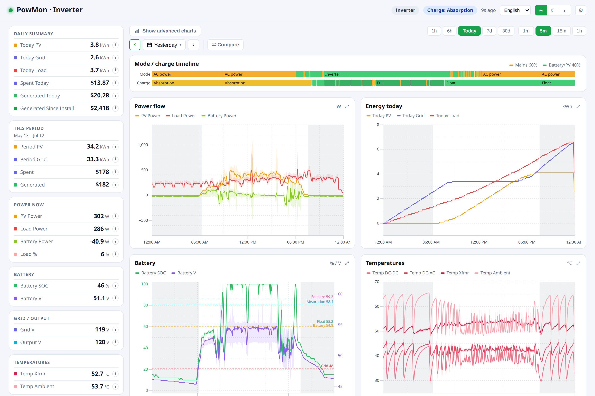
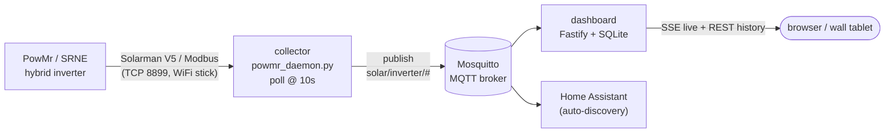
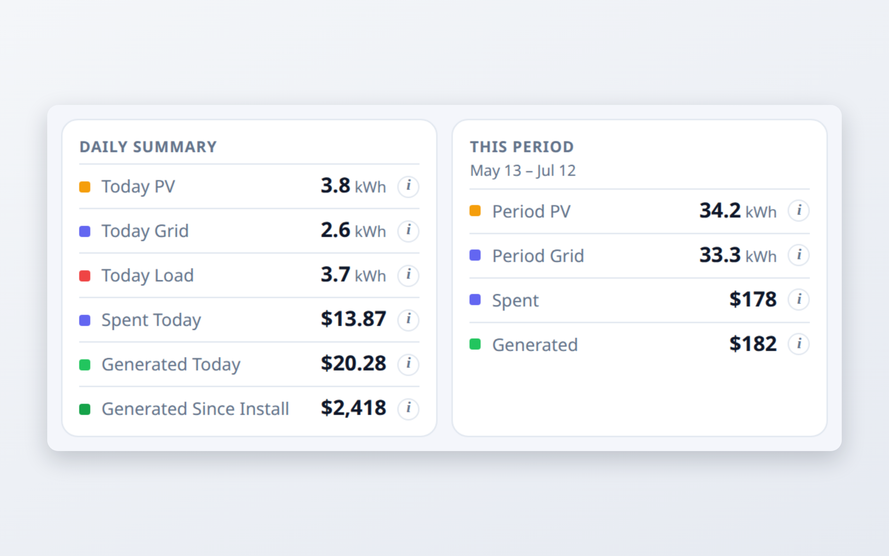
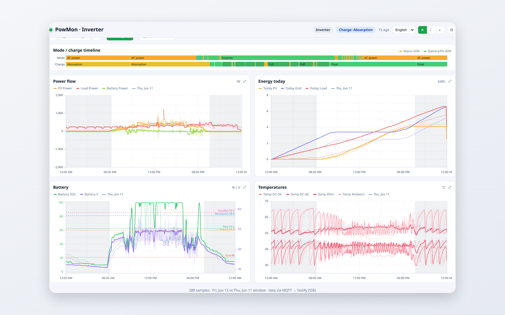
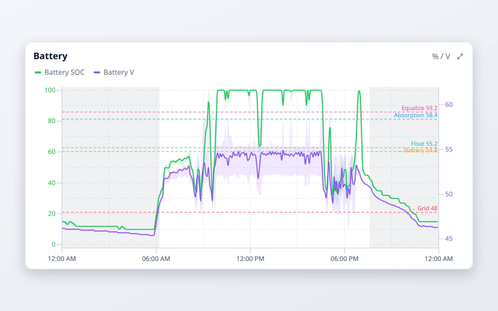
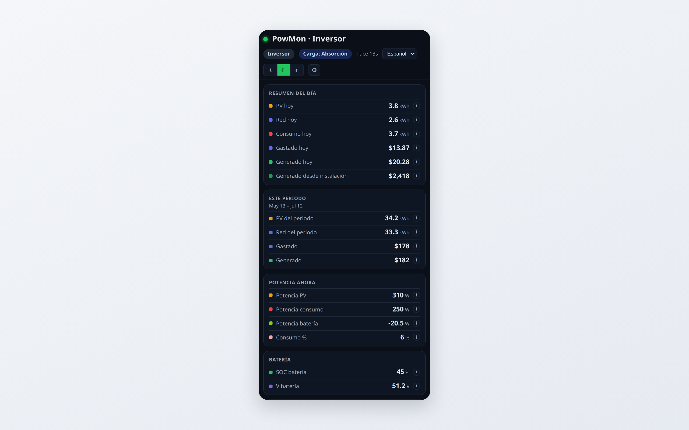

# PowMon

[](LICENSE)
[](https://github.com/Jesuso/powmon/actions/workflows/ci.yml)
[](CONTRIBUTING.md)
[](https://github.com/Jesuso/powmon/discussions)
[](https://github.com/sponsors/Jesuso)

**A live, local dashboard for PowMr / SRNE hybrid solar inverters — every number explained, every kWh translated into money.**

> The inverter speaks engineer; PowMon translates it into glances, plain words, and money.

A hybrid solar inverter knows everything about your energy — sun coming in, what
the battery holds, what the grid is charging you — but it speaks in registers,
acronyms, and a two-line LCD. PowMon reads the inverter over your LAN and turns
it into a dashboard anyone in the house can glance at: live state, 30 days of
history, and spent-vs-saved in your own currency. It also publishes to
[Home Assistant](https://www.home-assistant.io/) via MQTT auto-discovery.

**Watch, don't touch.** PowMon is read-only by design — no code path writes to
the inverter. **Local and private** — runs on your home network, no cloud
account, no sign-in, nothing leaves the house.



## How it works



Three small pieces, joined only by an MQTT topic contract (`solar/inverter/#`):

| Component | What it does | Stack |
|-----------|--------------|-------|
| [`collector/`](collector/) | Polls the inverter, publishes telemetry + HA discovery to MQTT | Python, `pysolarmanv5` |
| [`mosquitto/`](mosquitto/) | The MQTT broker that carries the data | Eclipse Mosquitto |
| [`dashboard/`](dashboard/) | Subscribes, stores history in SQLite, serves the live web UI | TypeScript, Fastify, React/visx |

See [`docs/architecture.md`](docs/architecture.md) for the full picture.

## Quick start (Docker)

You need the inverter's **WiFi datalogger IP** and its **serial number** (on the
stick's sticker, also shown as "Device SN" in the Solarman/PowMr app).

```bash
cp .env.example .env      # set INVERTER_IP + LOGGER_SERIAL
docker compose up -d
```

- **Dashboard:** `http://localhost:3001` (browsing on the host itself), or
  `http://<host-ip>:3001` from a phone, tablet, or another computer on your LAN.
- **Home Assistant:** point its MQTT integration at `<host-ip>:1883` — entities
  appear automatically via discovery.

Already run your own broker? Remove the `mosquitto` service from
[`compose.yml`](compose.yml) and set `MQTT_HOST` in `.env`.

→ Full walkthrough: [`docs/install-basic.md`](docs/install-basic.md). Bare-metal
/ systemd / custom broker: [`docs/install-advanced.md`](docs/install-advanced.md).

## Screenshots

<table>
<tr>
<td width="50%">



**Money, first-class.** Every kWh shown as what it cost — or saved — today and this billing period.

</td>
<td width="50%">



**Scan & compare.** 30 days of history; overlay any two days on one 00–24h axis.

</td>
</tr>
<tr>
<td width="50%">



**Honest depth.** SOC + voltage with your *real* charge setpoints drawn from the inverter; night auto-shaded.

</td>
<td width="50%">



**Any screen, any theme, two languages.** Wall tablet to phone · light / dark / OS · English / Spanish.

</td>
</tr>
</table>

## Hardware

Built and tested against a **PowMr POW-SunSmart SP5K**, which speaks the
**SRNE Modbus** protocol over a **Solarman V5** WiFi datalogger stick. Other
SRNE-based hybrid inverters with a Solarman/IGEN stick should work — the
register map is documented in [`docs/`](docs/). See
[`docs/hardware.md`](docs/hardware.md) for what's supported and how to find your
IP + serial.

## Repository layout

```
collector/     Python poller + telemetry daemon (powmr_*.py)
dashboard/     TypeScript web app (Fastify + SQLite + React) — see its README + PRODUCT.md
mosquitto/     MQTT broker config for the compose stack
systemd/       service units for bare-metal installs
infra/         optional: Cloudflare Tunnel (OpenTofu) for public exposure
dev-tools/     protocol reverse-engineering utilities (capture, fake cloud)
docs/          install guides, architecture, hardware, register maps
compose.yml    one-command Docker stack
```

## Documentation

- [Basic install (Docker)](docs/install-basic.md)
- [Advanced install (bare-metal, systemd, custom broker, HA)](docs/install-advanced.md)
- [Architecture & MQTT contract](docs/architecture.md)
- [Hardware & finding your inverter](docs/hardware.md)
- [Public exposure via Cloudflare Tunnel](docs/exposure.md)
- [SRNE config register map](docs/srne_config_registers.md)
- [Dashboard product principles](dashboard/PRODUCT.md) · [engineering notes](dashboard/README.md)
- [Contributing](CONTRIBUTING.md)

## Community & contributing

Contributions of every kind are welcome — code, docs, bug reports, ideas, and
testing on inverters we haven't tried yet.

- 🐛 **Found a bug?** [Open a bug report](https://github.com/Jesuso/powmon/issues/new/choose).
- 💡 **Idea or feature request?** [Start a Discussion](https://github.com/Jesuso/powmon/discussions/categories/ideas).
- 💬 **Question or setup help?** [Ask in Discussions Q&A](https://github.com/Jesuso/powmon/discussions/categories/q-a).
- 🔧 **Sending a PR?** Read [CONTRIBUTING.md](CONTRIBUTING.md) first — dev setup and the few rules that keep changes cheap.
- 🧭 **New here?** Look for [`good first issue`](https://github.com/Jesuso/powmon/labels/good%20first%20issue) labels.

By participating you agree to the [Code of Conduct](.github/CODE_OF_CONDUCT.md).
Found a security issue? Please report it privately — see [Security Policy](.github/SECURITY.md).

## Support

PowMon is free and open source. If it saves you money or headaches and you'd
like to give back, you can [**sponsor the project** ❤](https://github.com/sponsors/Jesuso).
A star, a bug report, or a PR helps just as much.

## Credits

PowMon builds on community reverse-engineering of the SRNE/Solarman protocols.
Full attribution and source links: [`SOURCES.md`](SOURCES.md).

## License

[MIT](LICENSE). PowMon reads the inverter and nothing more — use it, fork it,
break it knowingly.
