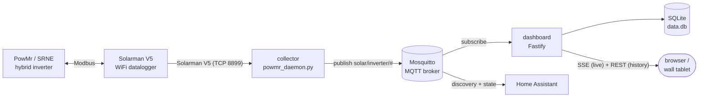
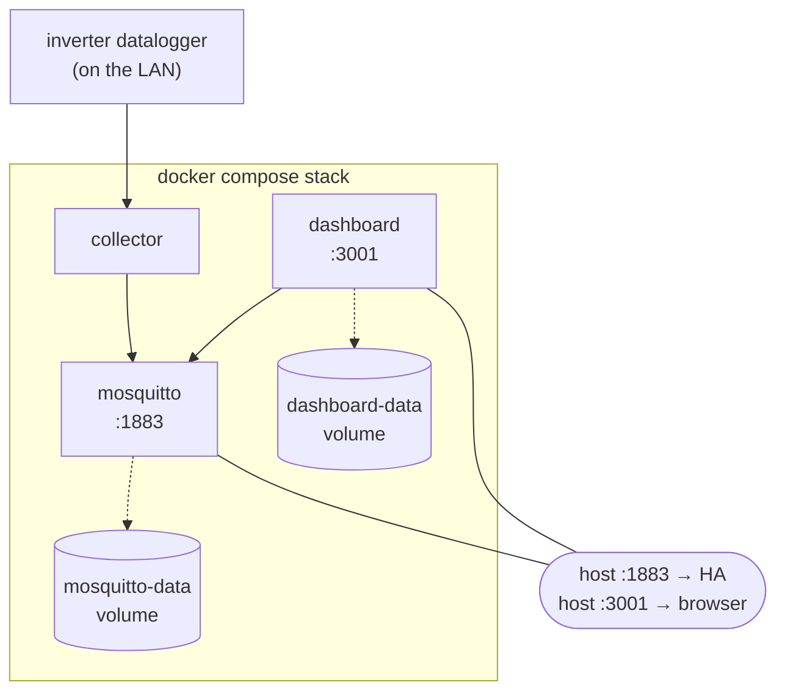
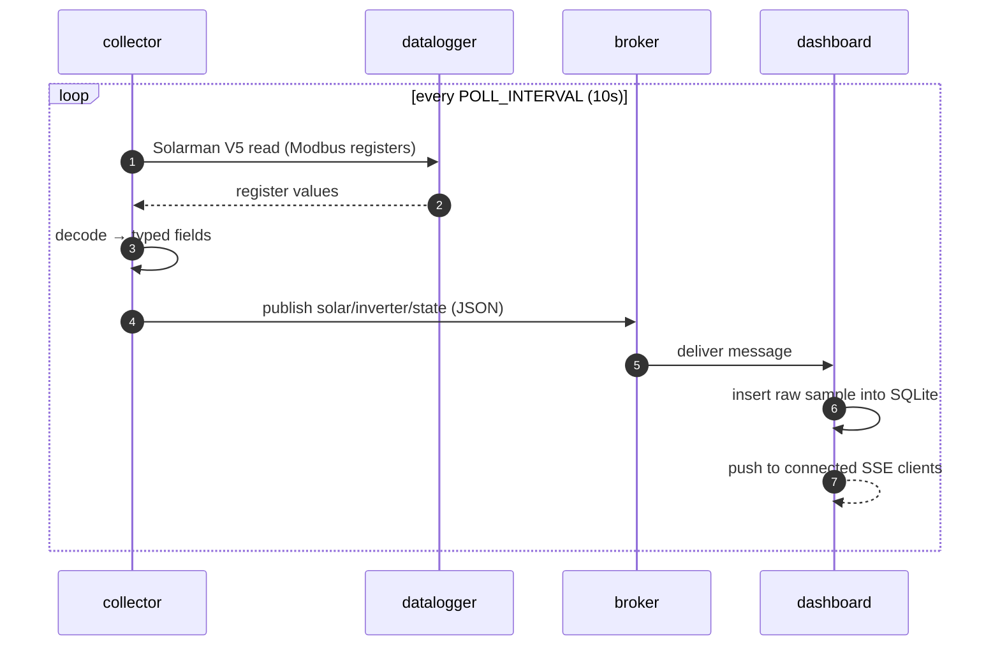

# Architecture

PowMon is three small, independent processes joined by one thing: an **MQTT
topic contract**. Each can be replaced, moved, or run standalone as long as it
honours the contract. Nothing shares a database or a function call across the
boundary.

## Data flow

1. The inverter talks **Modbus** to its **Solarman V5 WiFi stick**.
2. The **collector** (`powmr_daemon.py`) opens a Solarman V5 TCP session to the
   stick, reads the holding/input registers every `POLL_INTERVAL` seconds, and
   publishes two things to MQTT: live telemetry under `BASE_TOPIC`, and Home
   Assistant **discovery** messages so HA auto-creates the entities.
3. **Mosquitto** carries the messages. It's the only integration point.
4. The **dashboard** subscribes, persists every sample to SQLite, streams live
   updates to browsers over **SSE**, and answers history queries over **REST**.
5. **Home Assistant** (optional) subscribes to the same broker independently.

## MQTT topic contract

Everything hangs off `BASE_TOPIC` (default `solar/inverter`):

| Topic | Direction | Payload |
|-------|-----------|---------|
| `solar/inverter/state` | collector → all | JSON snapshot of the latest poll (all fields) |
| `solar/inverter/availability` | collector → all | `online` / `offline` (LWT) |
| `homeassistant/<component>/.../config` | collector → HA | discovery definitions (one per entity) |

The dashboard cares only about the state topic; Home Assistant cares about the
discovery + state topics. Change `BASE_TOPIC` and both sides must match.

> **Naming note:** the topic prefix is `solar/inverter` and the Python files are
> `powmr_*.py` for historical reasons (PowMr is the inverter vendor; PowMon is
> this tool). They're stable on purpose — renaming would churn deployed configs
> for no benefit.

## Container topology (Docker)

Ports `1883` (broker, for Home Assistant) and `3001` (dashboard) are published
to the host. History and broker state live in named volumes that survive
rebuilds. See [`compose.yml`](../compose.yml).

## Poll cycle

## Storage model

The dashboard stores the **raw inverter JSON** per sample. History aggregates
are computed at query time with SQLite `json_extract` — so:

- **No migrations.** New fields work retroactively against old rows.
- **Honest data.** The server never invents metrics; presentation (money,
  formatting, grouping) is derived client-side from a stored tariff.

Retention is `RETENTION_DAYS` (default 30). See
[`dashboard/README.md`](../dashboard/README.md) for the engineering principles
and [`dashboard/PRODUCT.md`](../dashboard/PRODUCT.md) for the product rules.

## Design invariants

- **Read-only.** No component ever writes to the inverter. This is a safety and
  trust guarantee, not a missing feature.
- **One contract, loose coupling.** Components integrate only through MQTT.
- **Local-first.** Everything runs on the home LAN; nothing requires a cloud
  account. Public exposure is opt-in and explicit ([exposure.md](exposure.md)).
